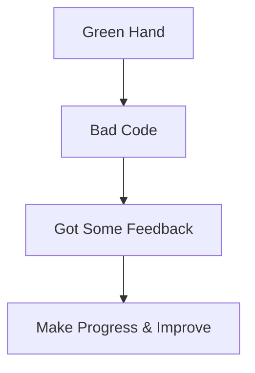

# Caesar_v2
网络服务协会技术部考核然后大家都在卷，我这边实在是难顶啊
## Notice
- **In fact, in my opinion, it's highly recommended that we should delete the CaesarEncryption interface and the Md5Encryption interface, and use the wizardInterface instead, then let the Caesar and the MD5 implements the wizardInterface.**
- **Because the method getResult(...) should be private, and the wizard should be public instead.**
- **However, if we set the method getResult(...) private, the interface must be deleted.**
## Why do I create this repoitory?
- 网络服务协会技术部考核然后大家都在卷，我这边实在是难顶啊
- I don't want to translate it into English and you don't need to understand.
## What is the usage of the project?
- It enables you to Encrypt/Decrypt Caesar password.
- It can also generate a string's MD5 code.
## How to run the project?
- The project requires JRE & JDK's support.
- And then open an IDE to compile `src/com/milkcandy23333/Main.java`
- Or you can add JDK's path to `PATH`,then input `javac Main.java`,and then `java Main` in CMD.
## Why is the code's quality so bad?
- I'm a green hand and I am not good at Java, it takes time to make progress and improve.:sweat_smile:

- Please give me some issues as feedback is a gift.
## How to contact me?
- myname#gmail.com
